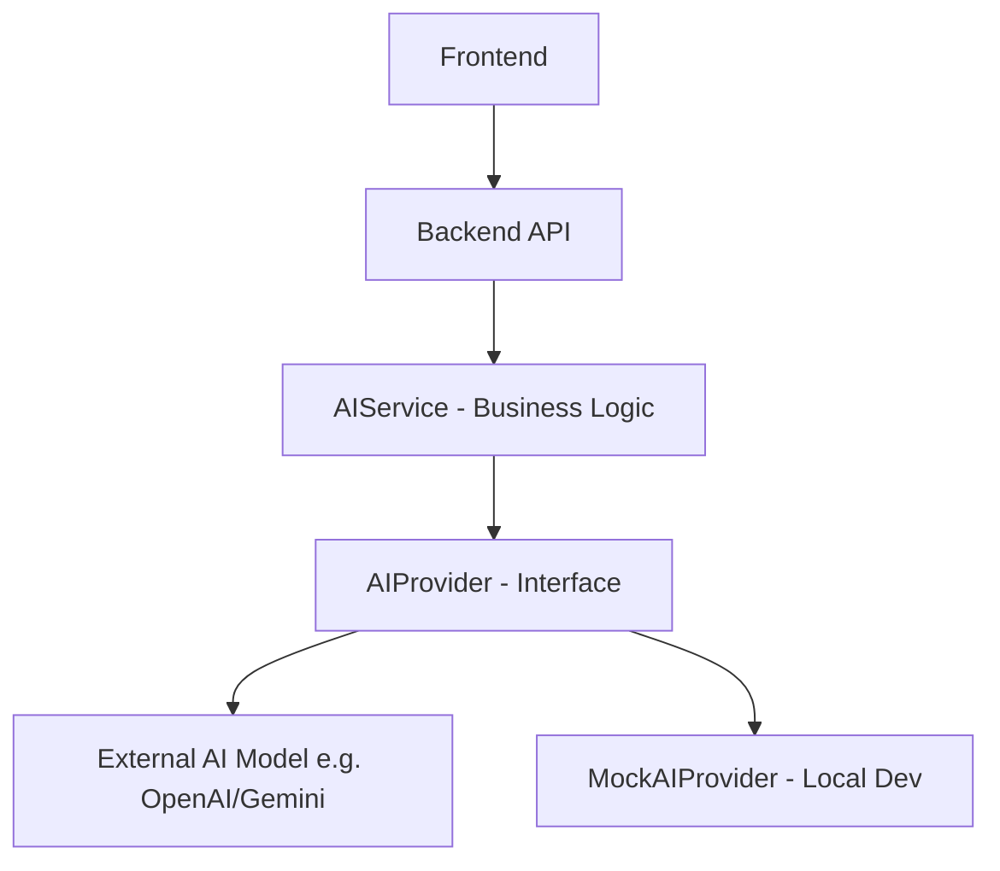

# AI Responsibility Model & Architecture

## Core Principle
AI must **not** silently override authoritative competency data. The deterministic system is the final source of truth.

### Deterministic System Responsibilities
- Authentication and Authorization (RBAC).
- Storing official competency scores and required role thresholds.
- Progress tracking and course completion calculations.
- Audit logging of all actions.

### AI Responsibilities
- Generating MCQs and Quizzes from uploaded learning materials.
- Semantic matching of official's skill gaps to available learning resources.
- Providing personalized learning recommendations and learning path generation.
- Contextual learning assistant (answering queries during a module).
- Extracting insights on emerging skill trends for Admin analytics.

---

## External AI Model Boundary

The actual AI model will not be directly coupled to the business logic.

We do not assume the provider, the API format, the model name, or the authentication mechanism. The `AIProvider` handles this abstraction.
