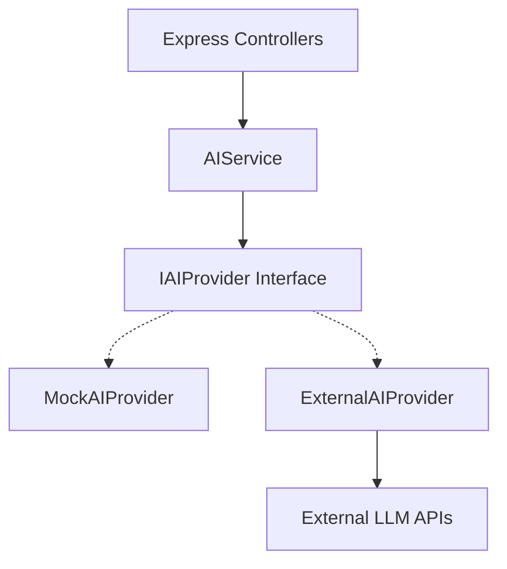

# AI Implementation & Abstraction Layer

## Overview
The AI Intelligence Layer handles dynamic generation of assessments, personalized learning paths, and provides contextual chat support for learners.

To ensure long-term flexibility, no specific LLM (e.g., OpenAI, Gemini, Claude) is hardcoded into the business logic. Instead, the application relies on an **AI Provider Abstraction Layer**.

## Architecture

### 1. `IAIProvider` Interface
Defines the strict contracts required by the product:
- `generateMCQs(text, competency, difficulty, count)`
- `generateRecommendations(profile, resources)`
- `chat(history, context)`
- `analyzeCompetency(learnerData)`

### 2. `MockAIProvider`
The default provider when running locally (`AI_PROVIDER=mock`).
- Returns syntactically correct dummy data.
- Simulates network delay (e.g., `setTimeout(1000)`).
- Allows frontend engineers and QA to test complete workflows without consuming API tokens or requiring an internet connection.

### 3. `ExternalAIProvider`
The production adapter (`AI_PROVIDER=external`).
- Uses `AI_API_KEY` and `AI_BASE_URL` (standard OpenAI-compatible REST endpoint).
- Injects strict JSON-Schema instructions into the system prompts to ensure the LLM returns data formatted precisely as the frontend expects.

### 4. Audit & Reliability
- All calls flow through `AIService.ts` which wraps executions in try/catch blocks.
- Every invocation is logged in the `AIRequestLog` collection (duration, status, requester).
- Async jobs like Quiz Generation are tracked via the `AIJob` collection.
