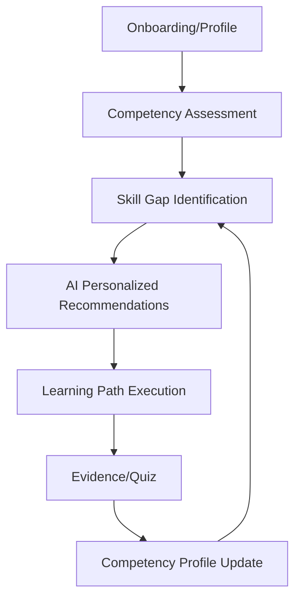
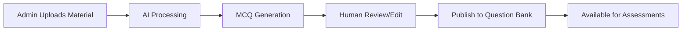
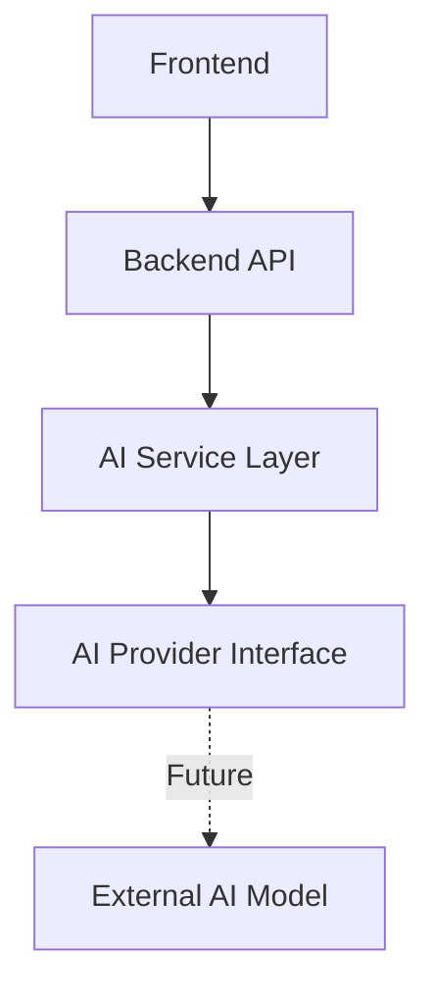
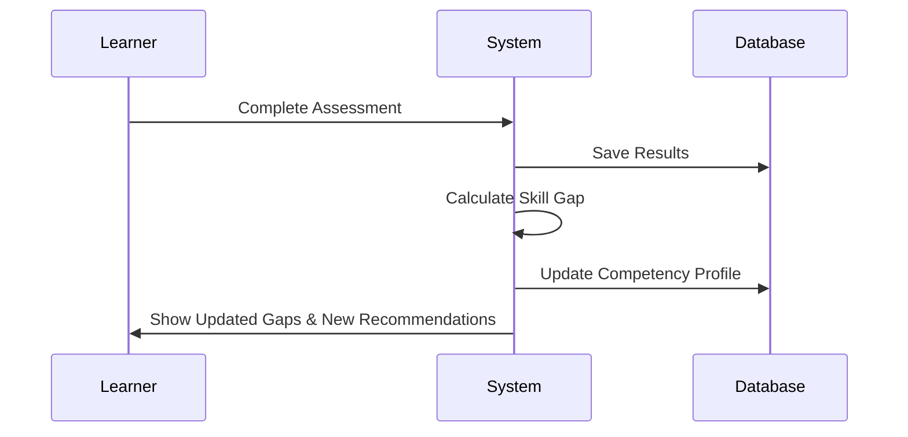

# User Flows & Workflows

## Roles Defined
1. **LEARNER:** The primary user (official) who takes assessments, identifies gaps, and learns.
2. **ADMIN:** Manages the system, workforce data, uploads materials, and reviews AI-generated content.
*(Note: No separate "Trainer" role is needed because content-management workflows for uploading materials and reviewing AI-generated questions can be seamlessly handled by the Admin role using RBAC policies.)*

## Detailed Flows

### A. Learner Onboarding
Learner -> Logs in -> System -> Checks profile completeness -> Database -> Returns status -> Learner prompted to complete profile.

### L. AI MCQ Generation (Admin)
Admin -> Uploads Material -> System -> Stores Material -> AI Service -> Extracts text & generates MCQs -> Database -> Saves Draft MCQs -> Admin notified for review.

### E. Learning Path & G. Assessment
Learner -> Starts Path -> System -> Loads Content -> Learner completes content -> Takes Quiz -> System -> Scores Quiz -> Database -> Saves Attempt -> Next Action: Competency Update.

---

## Workflow Diagrams (Mermaid)

### 1. Overall Platform Workflow

### 2. Admin Content Workflow

### 3. AI Architecture Boundary

### 4. Data Flow (Competency Loop)

